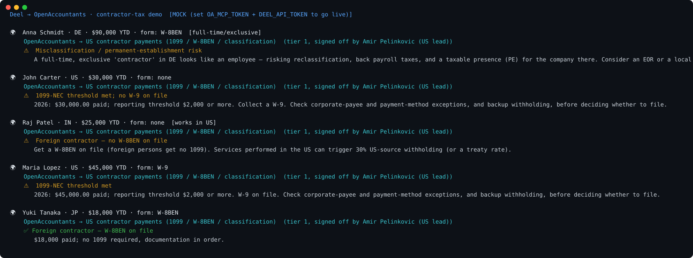

# Deel → OpenAccountants: contractor-tax demo

**The pitch in one line:** Deel pays your global contractors. OpenAccountants flags the **tax obligations and risks** behind each payment — misclassification, permanent establishment, 1099s, W-8BENs, withholding — signed off by a named licensed accountant.

```
Deel contractors
  └─ { name, country, us_person, ytd_paid, form_on_file, full_time_exclusive }
        └─ OpenAccountants MCP  →  load the verified contractor-payments skill
              └─ Verdict:  ⚠️ misclassification / permanent-establishment risk   ← the catch
                           ⚠️ 1099-NEC threshold met (US, 2026: $2,000+, no W-9)
                           ⚠️ foreign contractor — no W-8BEN (+ US-source withholding)
                           ✅ documentation in order
                 · the rule that decided it (cited)
                 · the named CPA who signed it off
```



> Regenerate the visual: `python make_svg.py` (static SVG, no deps) · animated GIF: `brew install vhs && vhs demo.tape`

## Why this one

Paying people across borders is a minefield Deel already navigates operationally — and OpenAccountants is the layer that surfaces the *tax* exposure on top of it:

- a **full-time, exclusive "contractor"** abroad looks like an employee — reclassification, back payroll taxes, and a **permanent establishment** (a taxable presence) for the company in that country. This is exactly the risk Deel's EOR product exists to remove;
- a **US contractor** reaches the general 1099-NEC threshold at **$2,000 in 2026** ($600 in 2025); check W-9 documentation separately;
- a **foreign contractor** needs a **W-8BEN** on file (no 1099), and US-source work can trigger withholding.

- **Deel = the global payment + compliance rails.**
- **OpenAccountants = the tax-risk lens** on each relationship, verified and accountant-signed.

## What it shows

Five contractors run through the OpenAccountants MCP:

| Contractor | Verdict |
|---|---|
| **DE — full-time, exclusive** | ⚠️ **Misclassification / PE risk** |
| US — $30k, no W-9 | ⚠️ 2026 reporting threshold met; collect W-9 |
| IN — no W-8BEN, works in US | ⚠️ W-8BEN + US-source withholding |
| US — W-9 on file | ✅ Documentation in order |
| JP — W-8BEN, part-time | ✅ Documentation in order |

**The money shot:** the German contractor working full-time and exclusively. On paper a contractor, in substance an employee — creating reclassification exposure *and* a permanent establishment for the company in Germany. OpenAccountants flags it; the fix (an EOR or a local entity) is exactly what Deel sells.

## Run it

```bash
git clone https://github.com/openaccountants/deel-contractor-demo
cd deel-contractor-demo
python pipeline.py                       # bundled sample (mock mode, no keys)
python pipeline.py samples/contractors.json
```

### Go live

```bash
export OA_MCP_TOKEN=...      # OpenAccountants account token (uses the live verified rules)
export DEEL_API_TOKEN=...    # Deel token (free self-serve sandbox at demo.deel.com)
python pipeline.py
```

## Files

| File | Role |
|------|------|
| `pipeline.py` | Orchestrator + CLI: Deel → OA → verdict report |
| `deel_client.py` | Deel contractor extraction (live API or bundled sample) |
| `oa_client.py` | OpenAccountants MCP JSON-RPC client (live or mock) |
| `contractor_check.py` | Checks each contractor's obligations/risks → verdict |
| `samples/contractors.json` | Deel-shaped contractors |

## Honest notes

- `contractor_check.py` is a **risk/obligation signal** — not a formal worker-classification opinion or a full treaty analysis. Production leans on the full OA skill + an agent step; the named-CPA sign-off makes the verdict relianceable.
- Rules (dated 1099 thresholds, W-9/W-8BEN, 30% US-source withholding) are US figures; live, every value comes from `get_skill`. The verifier (Amir Pelinkovic) is the real OpenAccountants US lead.

The bundled records use `payment_year: 2026`. Supply the payment year for each record. Threshold rules are keyed by year: 2025 is $600 and 2026 is $2,000, inclusive. An absent year or rule produces a warning, including for later years that need inflation-adjusted figures. A W-9 does not remove a reporting obligation, and a missing W-9 does not establish one. Corporate-payee exemptions, payment-card reporting and backup withholding need separate checks. Source: [IRS information-return requirements](https://www.irs.gov/businesses/small-businesses-self-employed/am-i-required-to-file-a-form-1099-or-other-information-return).

Run the offline checks with `python -m unittest discover -s tests -v`.
